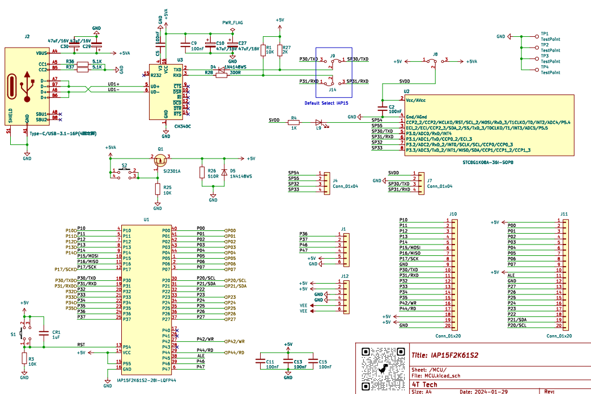

# 蓝桥杯单片机

## 一、基础知识

### 01 LED亮灭控制

```c
void main(){

	while(1){
		P2 = ((P2 & 0x1F) | 0x80); // 闲鱼清零前三位，在写前三位 138译码器 
		LED_Port = 0xFF; //LED关
		P2 &= 0x1F; 
		delay();

		P2 = ((P2 & 0x1F) | 0x80); // 闲鱼清零前三位，在写前三位 138译码器
		LED_Port = 0x00; //LED开
		P2 &= 0x1F; 
		delay();
	}
}


```

### 02 LED按位移

```c
void main(){
    unsigned char i = 0; //1111 1110  
    cls_hardware();
	while(1){
        for(i = 0;i < 8;i ++){
            P2 = (P2 & 0x1F) | 0x80; //选中Y4 LED ENA
            P0 = 0xFE<<i;//1111 1110  按位左移，低位取0
            P2 &= 0x1F;//译码器复位
            delay();//延时200ms
        }
	}
}

```

### 03 独立按键控制LED位移

## 二、真题练习

## 三、相关资料

### 01 中断系统

- STC15F2K60S2中断结构 `</br>`

| 中断源             | 中断优先级级别              | 备注                 |
| :----------------- | :-------------------------- | :------------------- |
| 定时器0中断 (T0)   | 2级（可配置为高或低优先级） | -                    |
| 外部中断1 (INT1)   | 2级（可配置为高或低优先级） | -                    |
| 定时器1中断 (T1)   | 2级（可配置为高或低优先级） | -                    |
| 串口1中断          | 2级（可配置为高或低优先级） | -                    |
| A/D转换中断        | 2级（可配置为高或低优先级） | -                    |
| 低压检测中断 (LVD) | 2级（可配置为高或低优先级） | -                    |
| CCP/PWM/PCA中断    | 2级（可配置为高或低优先级） | -                    |
| 串口2中断          | 2级（可配置为高或低优先级） | -                    |
| SPI中断            | 2级（可配置为高或低优先级） | -                    |
| 外部中断2 (INT2)   | 最低优先级                  | 优先级固定，不可配置 |
| 外部中断3 (INT3)   | 最低优先级                  | 优先级固定，不可配置 |
| 定时器2中断 (T2)   | 最低优先级                  | 优先级固定，不可配置 |
| 外部中断4 (INT4)   | 最低优先级                  | 优先级固定，不可配置 |


