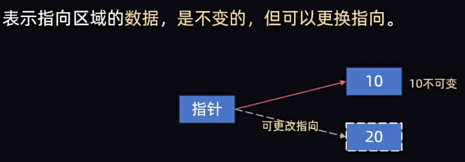

# C ---> C++过渡笔记

## 1、动态内存分配

### 使用方法

**静态内存管理**：程序不会自动释放冗余的或程序不用的内存空间

**动态内存管理**：程序员手动管理内存空间

- new type;   申请普通变量空间
- new type[n];    申请数组空间
- delete 指针;    删除普通变量空间
- delete[] 指针;    删除数组空间

```c++
//申请普通变量空间并删除
int *p = new int;

*p = 10;

std::cout << *p << std::endl;

delete p;

//申请数组变量空间并删除

int *q = new int[5];

q[0] = 10;
*q = 11;
*(q ++) = 20;

delete[] q;

```

### 数组元素移除

```c++

int *p = new int[5] {1, 3, 5, 7, 9};

int *pNew = new int[4];

int *j = new int{0};

// 假设要移除3
for(int i = 0; i < 5; i ++){
    if(p[i] == 3){
        continue;
    }
    pNew[*j] = p[i];
    (*j) ++;
}

delete[] p;
delete j;

p = pNew; //可选

```

### 指针悬挂

**指针悬挂**：指针指向的区域已经被回收（delete），这种问题称之为：指针悬挂。

分析以下情况：

```c++

int *p1 = new int{10}; 

int *p2 = p1;

delete p1;

```

p1被释放后p2已经无法正常使用，此时p1、p2同为yezhizhen。

解决方法：

- 不要轻易进行指针间相互赋值
- delete回收前确保此空间100%不会被再次使用

### 常量指针

- **指向const的指针：**



声明方法

const 数据类型 * 指针;

```c++

int n1{10}, n2{100};

const int * p = &n1;

*p = 20; //此时会发生报错，指向区域的值不可修改

p = &n2; // 但是可以更改指向

```

- **const指针：**


声明方法

数据类型 const * 指针 = 地址; //必须初始化地址，因为指针不可修改了

```c++

int n1{10},n2{100};

int * const p = &n1;

*p = 20; // 指向的值可以修改

p = &n2; // 此处会报错，指针不可修改


```

- **指向const的const指针：**


声明方法

const 数据类型 const * 指针 = 地址; //必须初始化地址，因为指针不可修改了

```c++

int n1{10},n2{100};

int * const p = &n1;

*p = 20; // 此处会报错，指向的值不可以修改

p = &n2; // 此处会报错，指针不可修改


```