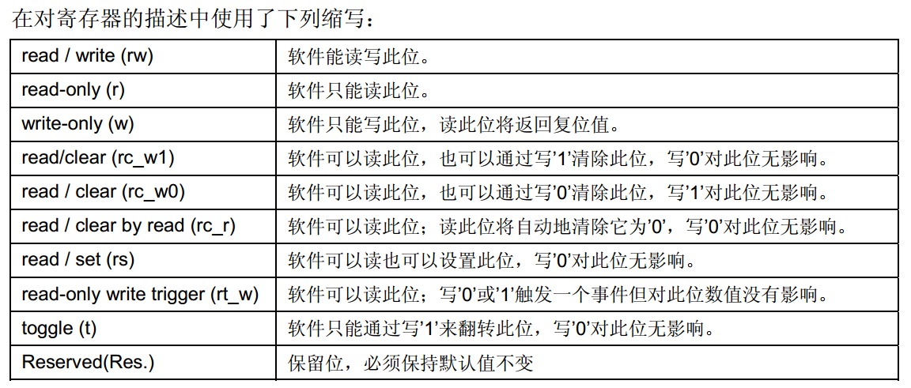
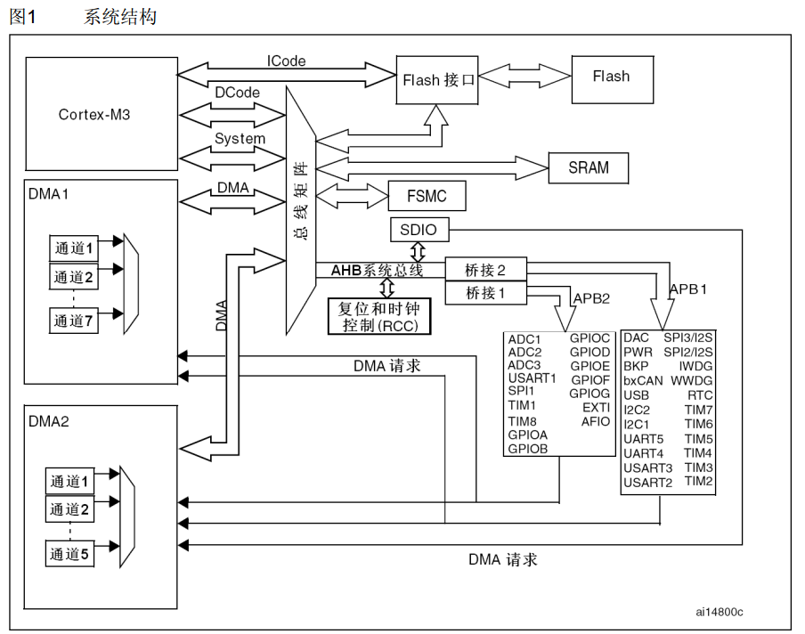
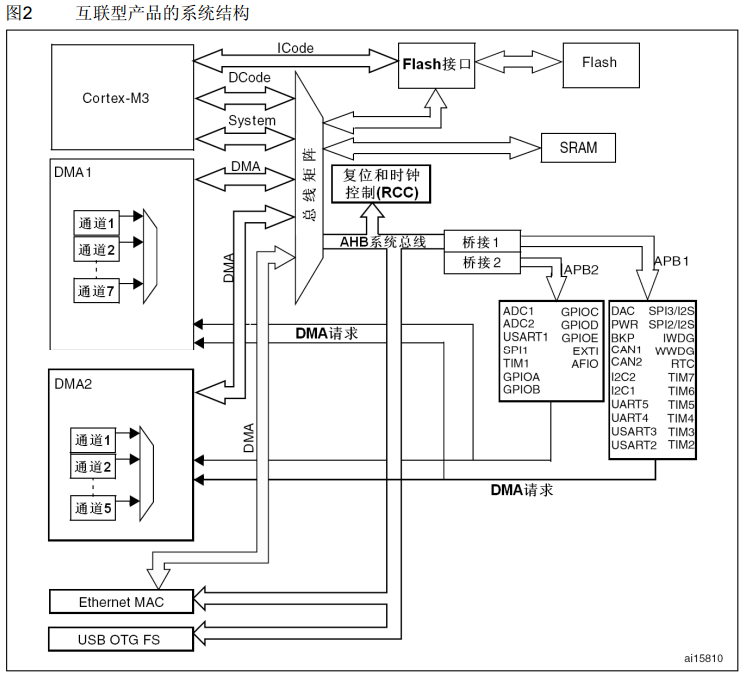

# STM32学习笔记

## 一、缩写指南

- 寄存器描述中所使用的缩写列表


## 二、存储器与总线架构

### 1、系统架构

- 在小容量、中容量和 大容量产品中，主系统由以下部分构成：



四个驱动单元：
─ Cortex™-M3内核DCode总线(D-bus)，和系统总线(S-bus)
─ 通用DMA1和通用DMA2
四个被动单元
─ 内部SRAM
─ 内部闪存存储器
─ FSMC
─ AHB到APB的桥(AHB2APBx)，它连接所有的APB设备    

- 在互联型产品中，主系统由以下部分构成：



五个驱动单元：
─ Cortex™-M3内核DCode总线(D-bus)，和系统总线(S-bus)
─ 通用DMA1和通用DMA2
─ 以太网DMA
三个被动单元：
─ 内部SRAM
─ 内部闪存存储器
─ AHB到APB的桥(AHB2APBx)，它连接所有的APB设备

---

## 三、GPIO 通用输入输出

### 1、GPIO 概述

- STM32的GPIO可实现数字信号的输入和输出控制
- STM32F10x最多提供112个多功能双向I/O引脚
- 每个GPIO端口16个引脚（PA0~~PA15），共7个端口（A~~G）
- 可承受5V电压，部分引脚支持直接驱动LED

### 2、GPIO 八种工作模式


| 模式     | 说明         | 典型应用         |
| ------ | ---------- | ------------ |
| 输入浮空   | 无上下拉，电平不稳定 | 按键检测（需外接上下拉） |
| 输入上拉   | 内部上拉，默认高电平 | 按键接GND时使用    |
| 输入下拉   | 内部下拉，默认低电平 | 按键接VCC时使用    |
| 模拟输入   | 内部电路关闭     | ADC/DAC输入    |
| 推挽输出   | 高低电平均可驱动   | LED、数字信号     |
| 开漏输出   | 仅能拉低，需外加上拉 | I2C、电平转换     |
| 推挽复用输出 | 外设功能推挽输出   | USART_TX、PWM |
| 开漏复用输出 | 外设功能开漏输出   | I2C_SDA      |


### 3、GPIO 寄存器


| 寄存器     | 功能                      |
| ------- | ----------------------- |
| CRL/CRH | 端口配置（低8/高8脚），每4位控制模式与速度 |
| IDR     | 输入数据寄存器（只读）             |
| ODR     | 输出数据寄存器（可读写）            |
| BSRR    | 位设置/清除：低16位置位，高16位清零    |
| BRR     | 位复位寄存器：写1清零ODR          |
| LCKR    | 配置锁定，防止意外修改             |


### 4、初始化步骤

```c
// ①使能时钟
RCC_APB2PeriphClockCmd(RCC_APB2Periph_GPIOA, ENABLE);
// ②配置结构体
GPIO_InitTypeDef GPIO_InitStructure;
GPIO_InitStructure.GPIO_Pin = GPIO_Pin_0;
GPIO_InitStructure.GPIO_Mode = GPIO_Mode_Out_PP;  // 推挽输出
GPIO_InitStructure.GPIO_Speed = GPIO_Speed_50MHz;
// ③初始化
GPIO_Init(GPIOA, &GPIO_InitStructure);
// ④操作
GPIO_SetBits(GPIOA, GPIO_Pin_0);   // 置高
GPIO_ResetBits(GPIOA, GPIO_Pin_0); // 置低
```

---

## 四、NVIC 中断管理

### 1、中断概述

- STM32F10x支持84个中断通道（16个内核 + 68个可屏蔽外设中断）
- NVIC负责中断优先级管理与调度
- 两级优先级：抢占优先级（主）+ 子优先级（次）
- **抢占规则**：高抢占优先级可打断低抢占优先级的中断
- **响应规则**：相同抢占优先级时，高子优先级优先响应（但不可打断）

### 2、优先级分组

```c
NVIC_PriorityGroupConfig(NVIC_PriorityGroup_2); // 常用：2位抢占+2位子优先级
```


| 分组      | 抢占位数 | 子优先级位数 | 抢占范围 | 子优先级范围 |
| ------- | ---- | ------ | ---- | ------ |
| Group_0 | 0    | 4      | 0    | 0~15   |
| Group_1 | 1    | 3      | 0~1  | 0~7    |
| Group_2 | 2    | 2      | 0~3  | 0~3    |
| Group_3 | 3    | 1      | 0~7  | 0~1    |
| Group_4 | 4    | 0      | 0~15 | 0      |


### 3、配置步骤

```c
// ①设置分组（整个工程只设一次）
NVIC_PriorityGroupConfig(NVIC_PriorityGroup_2);
// ②配置NVIC结构体
NVIC_InitTypeDef NVIC_InitStructure;
NVIC_InitStructure.NVIC_IRQChannel = EXTI0_IRQn;
NVIC_InitStructure.NVIC_IRQChannelPreemptionPriority = 1;
NVIC_InitStructure.NVIC_IRQChannelSubPriority = 1;
NVIC_InitStructure.NVIC_IRQChannelCmd = ENABLE;
// ③初始化
NVIC_Init(&NVIC_InitStructure);
```

---

## 五、EXTI 外部中断

### 1、EXTI 概述

- 支持20个中断/事件线，前16个（EXTI0~15）对应GPIO引脚
- 可配置上升沿、下降沿、双边沿触发
- **注意**：同一编号的EXTI线只能映射一个端口引脚（如PA0和PB0不能同时用EXTI0）

### 2、中断线映射


| 中断线      | 映射源                    |
| -------- | ---------------------- |
| EXTI0~15 | PAx/PBx/PCx...（x = 线号） |
| EXTI16   | PVD 电源电压检测             |
| EXTI17   | RTC 闹钟                 |
| EXTI18   | USB 唤醒                 |
| EXTI19   | 以太网唤醒                  |


### 3、配置步骤

```c
// ①使能时钟
RCC_APB2PeriphClockCmd(RCC_APB2Periph_GPIOA | RCC_APB2Periph_AFIO, ENABLE);
// ②配置GPIO为输入
GPIO_InitStructure.GPIO_Pin = GPIO_Pin_0;
GPIO_InitStructure.GPIO_Mode = GPIO_Mode_IPU; // 上拉输入
GPIO_Init(GPIOA, &GPIO_InitStructure);
// ③映射GPIO到中断线
GPIO_EXTILineConfig(GPIO_PortSourceGPIOA, GPIO_PinSource0);
// ④配置EXTI
EXTI_InitTypeDef EXTI_InitStructure;
EXTI_InitStructure.EXTI_Line = EXTI_Line0;
EXTI_InitStructure.EXTI_Mode = EXTI_Mode_Interrupt;
EXTI_InitStructure.EXTI_Trigger = EXTI_Trigger_Falling;
EXTI_InitStructure.EXTI_LineCmd = ENABLE;
EXTI_Init(&EXTI_InitStructure);
// ⑤NVIC配置（略）
// ⑥中断服务函数
void EXTI0_IRQHandler(void) {
    if(EXTI_GetITStatus(EXTI_Line0) != RESET) {
        // 处理事件
        EXTI_ClearITPendingBit(EXTI_Line0);
    }
}
```

---

## 六、定时器 TIM

### 1、定时器分类


| 类型            | 位数     | 功能                 |
| ------------- | ------ | ------------------ |
| 基本定时器（TIM6/7） | 16位    | 仅向上计数，无I/O         |
| 通用定时器（TIM2~5） | 16/32位 | 向上/下/中央对齐、PWM、输入捕获 |
| 高级定时器（TIM1/8） | 16位    | 通用功能 + 互补PWM、刹车    |


### 2、时基单元

- **PSC**（预分频器）：对时钟分频，得到计数器时钟 CK_CNT = CK_PSC / (PSC+1)
- **ARR**（自动重装载寄存器）：计数周期值
- **CNT**（计数器）：当前计数值
- **溢出时间公式**：

  $$T_{out} = \frac{(ARR+1) \times (PSC+1)}{TIM\_CLK}$$

  > 例如：TIM_CLK = 72MHz，PSC = 7199，ARR = 9999 → T_out = 1秒

### 3、PWM 输出

- **占空比**由 CCRx 寄存器控制：Duty = CCRx / (ARR+1)
- 配置步骤：

```c
// ①GPIO配置为复用推挽输出
// ②时基初始化
TIM_TimeBaseStructure.TIM_Period = arr;
TIM_TimeBaseStructure.TIM_Prescaler = psc;
TIM_TimeBaseInit(TIMx, &TIM_TimeBaseStructure);
// ③PWM模式配置
TIM_OCInitStructure.TIM_OCMode = TIM_OCMode_PWM1;
TIM_OCInitStructure.TIM_OutputState = TIM_OutputState_Enable;
TIM_OCInitStructure.TIM_Pulse = ccr; // 占空比
TIM_OCxInit(TIMx, &TIM_OCInitStructure);
// ④使能
TIM_Cmd(TIMx, ENABLE);
```

### 4、输入捕获

- 用于测量信号的频率、占空比
- 边沿检测 → 记录CNT值 → 两次差值 = 周期

```c
TIM_ICInitStructure.TIM_Channel = TIM_Channel_1;
TIM_ICInitStructure.TIM_ICPolarity = TIM_ICPolarity_Rising;
TIM_ICInitStructure.TIM_ICSelection = TIM_ICSelection_DirectTI;
TIM_ICInitStructure.TIM_ICPrescaler = TIM_ICPSC_DIV1;
TIM_ICInitStructure.TIM_ICFilter = 0x0;
TIM_ICInit(TIMx, &TIM_ICInitStructure);
```

---

## 七、USART 串口通信

### 1、通信基础

- **异步串行通信**：不需要时钟线，双方约定波特率
- **数据帧格式**：起始位(1) + 数据位(8/9) + 校验位(可选) + 停止位(1/0.5/2)
- **波特率**：每秒传输的码元数（bps）
- **常用波特率**：9600、115200

### 2、USART 框图要点

- **发送器**：数据写入DR → 移位寄存器 → TX引脚
- **接收器**：RX引脚 → 移位寄存器 → 存入DR
- **波特率发生器**：由USARTDIV控制

  $$Tx/Rx\_Baud = \frac{f_{CK}}{16 \times USARTDIV}$$


### 3、配置步骤

```c
// ① GPIO: TX → 复用推挽，RX → 浮空输入
// ② 时钟：USART1在APB2，USART2/3在APB1
// ③ USART配置
USART_InitTypeDef USART_InitStructure;
USART_InitStructure.USART_BaudRate = 115200;
USART_InitStructure.USART_WordLength = USART_WordLength_8b;
USART_InitStructure.USART_StopBits = USART_StopBits_1;
USART_InitStructure.USART_Parity = USART_Parity_No;
USART_InitStructure.USART_Mode = USART_Mode_Rx | USART_Mode_Tx;
USART_InitStructure.USART_HardwareFlowControl = USART_HardwareFlowControl_None;
USART_Init(USART1, &USART_InitStructure);
// ④使能
USART_Cmd(USART1, ENABLE);
// ⑤发送/接收
USART_SendData(USART1, data);
u16 rx = USART_ReceiveData(USART1);
```

### 4、printf 重定向

```c
int fputc(int ch, FILE *f) {
    while(USART_GetFlagStatus(USART1, USART_FLAG_TXE) == RESET);
    USART_SendData(USART1, (uint8_t)ch);
    return ch;
}
```

> 需勾选 MicroLIB（Target → Use MicroLIB）

---

## 八、ADC 模数转换

### 1、ADC 概述

- STM32F10x 内置12位逐次逼近型ADC，最多18个通道
- 可测量16个外部+2个内部信号源
- **12位分辨率**：0~4095，参考电压通常为3.3V
- **转换公式**：$$V_{in} = \frac{ADC\_Value}{4095} \times V_{REF}$$

### 2、工作模式


| 模式   | 说明             |
| ---- | -------------- |
| 单次转换 | 触发一次转换一次       |
| 连续转换 | 转换结束后立即开始下一次   |
| 扫描模式 | 按序转换一组通道       |
| 间断模式 | 每次触发转换一组中的N个通道 |
| 注入通道 | 高优先级通道，可打断规则通道 |


### 3、配置步骤（单通道，软件触发）

```c
// ① GPIO: 模拟输入模式
// ② RCC: ADC时钟 ≤ 14MHz（PCLK2的2/4/6/8分频）
RCC_ADCCLKConfig(RCC_PCLK2_Div6); // 72M/6=12MHz
// ③ ADC配置
ADC_InitTypeDef ADC_InitStructure;
ADC_InitStructure.ADC_Mode = ADC_Mode_Independent;      // 独立模式
ADC_InitStructure.ADC_ScanConvMode = DISABLE;            // 非扫描
ADC_InitStructure.ADC_ContinuousConvMode = DISABLE;      // 单次转换
ADC_InitStructure.ADC_ExternalTrigConv = ADC_ExternalTrigConv_None; // 软件触发
ADC_InitStructure.ADC_DataAlign = ADC_DataAlign_Right;   // 右对齐
ADC_InitStructure.ADC_NbrOfChannel = 1;
ADC_Init(ADC1, &ADC_InitStructure);
// ④使能ADC并校准
ADC_Cmd(ADC1, ENABLE);
ADC_ResetCalibration(ADC1);
while(ADC_GetResetCalibrationStatus(ADC1));
ADC_StartCalibration(ADC1);
while(ADC_GetCalibrationStatus(ADC1));
// ⑤读取
ADC_RegularChannelConfig(ADC1, ADC_Channel_0, 1, ADC_SampleTime_55Cycles5);
ADC_SoftwareStartConvCmd(ADC1, ENABLE);
while(!ADC_GetFlagStatus(ADC1, ADC_FLAG_EOC));
u16 adc = ADC_GetConversionValue(ADC1);
```

---

## 九、DMA 直接存储器访问

### 1、DMA 概述

- DMA传输不占用CPU，实现数据在**外设→内存**或**内存→外设**之间高速搬运
- STM32F10x有2个DMA控制器（DMA1有7通道，DMA2有5通道）

### 2、DMA 通道映射（部分）


| 外设        | DMA1通道 | DMA2通道 |
| --------- | ------ | ------ |
| ADC1      | CH1    | -      |
| USART1_TX | CH4    | -      |
| USART1_RX | CH5    | -      |
| TIM1_CH1  | -      | CH6    |


### 3、配置步骤（ADC1 + DMA）

```c
// ① DMA时钟
RCC_AHBPeriphClockCmd(RCC_AHBPeriph_DMA1, ENABLE);
// ② DMA配置
DMA_InitTypeDef DMA_InitStructure;
DMA_DeInit(DMA1_Channel1);
DMA_InitStructure.DMA_PeripheralBaseAddr = (u32)&ADC1->DR; // 外设地址
DMA_InitStructure.DMA_MemoryBaseAddr = (u32)adc_buf;       // 内存地址
DMA_InitStructure.DMA_DIR = DMA_DIR_PeripheralSRC;         // 外设→内存
DMA_InitStructure.DMA_BufferSize = N;                      // 传输数量
DMA_InitStructure.DMA_PeripheralInc = DMA_PeripheralInc_Disable;
DMA_InitStructure.DMA_MemoryInc = DMA_MemoryInc_Enable;
DMA_InitStructure.DMA_PeripheralDataSize = DMA_PeripheralDataSize_HalfWord;
DMA_InitStructure.DMA_MemoryDataSize = DMA_MemoryDataSize_HalfWord;
DMA_InitStructure.DMA_Mode = DMA_Mode_Circular;            // 循环模式
DMA_InitStructure.DMA_Priority = DMA_Priority_High;
DMA_InitStructure.DMA_M2M = DMA_M2M_Disable;
DMA_Init(DMA1_Channel1, &DMA_InitStructure);
// ③使能DMA + ADC的DMA请求
DMA_Cmd(DMA1_Channel1, ENABLE);
ADC_DMACmd(ADC1, ENABLE);
```

---

## 十、I2C 与 SPI 通信

### I2C 部分

### 1、I2C 总线特点

- **两线制**：SCL（时钟）+ SDA（数据），均需外接上拉电阻（4.7KΩ）
- **多主多从**，每个设备有唯一7位地址
- **速率**：标准模式100KHz，快速模式400KHz
- **时序**：起始条件（SCL高时SDA拉低）→ 地址+读写 → 数据 → 应答 → 停止条件（SCL高时SDA拉高）

### 2、I2C 读写流程

```c
// 主机发送流程
I2C_GenerateSTART(I2Cx, ENABLE);
while(!I2C_CheckEvent(I2Cx, I2C_EVENT_MASTER_MODE_SELECT));
I2C_Send7bitAddress(I2Cx, addr, I2C_Direction_Transmitter);
while(!I2C_CheckEvent(I2Cx, I2C_EVENT_MASTER_TRANSMITTER_MODE_SELECTED));
I2C_SendData(I2Cx, data);
while(!I2C_CheckEvent(I2Cx, I2C_EVENT_MASTER_BYTE_TRANSMITTED));
I2C_GenerateSTOP(I2Cx, ENABLE);
```

### SPI 部分

### 3、SPI 特点

- **四线制**：SCK（时钟）、MOSI（主出从入）、MISO（主入从出）、NSS（片选）
- **全双工**，主从模式，最高18MHz
- **四种模式**（CPOL + CPHA）：决定时钟极性与采样相位


| 模式  | CPOL | CPHA | 空闲电平 | 采样沿  |
| --- | ---- | ---- | ---- | ---- |
| 0   | 0    | 0    | 低    | 第1边沿 |
| 1   | 0    | 1    | 低    | 第2边沿 |
| 2   | 1    | 0    | 高    | 第1边沿 |
| 3   | 1    | 1    | 高    | 第2边沿 |


### 4、SPI 配置

```c
SPI_InitTypeDef SPI_InitStructure;
SPI_InitStructure.SPI_Direction = SPI_Direction_2Lines_FullDuplex;
SPI_InitStructure.SPI_Mode = SPI_Mode_Master;
SPI_InitStructure.SPI_DataSize = SPI_DataSize_8b;
SPI_InitStructure.SPI_CPOL = SPI_CPOL_Low;
SPI_InitStructure.SPI_CPHA = SPI_CPHA_1Edge;
SPI_InitStructure.SPI_NSS = SPI_NSS_Soft;     // 软件控制NSS
SPI_InitStructure.SPI_BaudRatePrescaler = SPI_BaudRatePrescaler_256;
SPI_InitStructure.SPI_FirstBit = SPI_FirstBit_MSB;
SPI_InitStructure.SPI_CRCPolynomial = 7;
SPI_Init(SPIx, &SPI_InitStructure);
SPI_Cmd(SPIx, ENABLE);
// 收发
SPI_I2S_SendData(SPIx, data);
u16 rx = SPI_I2S_ReceiveData(SPIx);
```

---

## 十一、RCC 时钟系统

### 1、时钟源


| 时钟源 | 频率        | 说明              |
| --- | --------- | --------------- |
| HSI | 8MHz      | 内部高速RC，精度较差     |
| HSE | 4~16MHz   | 外部高速晶振，常用8MHz   |
| LSI | 40KHz     | 内部低速RC，供看门狗/RTC |
| LSE | 32.768KHz | 外部低速晶振，供RTC     |


### 2、时钟树关键路径

```
HSE(8MHz) → PLL(x9倍频) → PLLCLK(72MHz) → SYSCLK
                                             ↓
                     ┌───────────┬───────────┼───────────┐
                   AHB(72M)   APB2(72M)   APB1(36M)
                   (DMA等)    (GPIO/TIM1) (TIM2~7/I2C)
```

### 3、常用配置

```c
// 典型：HSE→PLL→72MHz
RCC_HSEConfig(RCC_HSE_ON);
while(RCC_WaitForHSEStartUp() != SUCCESS);
RCC_PLLConfig(RCC_PLLSource_HSE_Div1, RCC_PLLMul_9); // 8M×9=72M
RCC_PLLCmd(ENABLE);
while(RCC_GetFlagStatus(RCC_FLAG_PLLRDY) == RESET);
RCC_SYSCLKConfig(RCC_SYSCLKSource_PLLCLK);
// 检查APB2(1分频)和APB1(2分频)是否自动设置正确
RCC_HCLKConfig(RCC_SYSCLK_Div1);  // AHB = 72M
RCC_PCLK2Config(RCC_HCLK_Div1);   // APB2 = 72M  
RCC_PCLK1Config(RCC_HCLK_Div2);   // APB1 = 36M
```

> ⚠️ 定时器时钟：若APB预分频≠1，TIM时钟 = 2×APB时钟（因此APB1为36MHz时，TIM2~7实际时钟=72MHz）

---

## 十二、看门狗

### 1、独立看门狗 IWDG

- 由LSI（40KHz）驱动，独立于主时钟，**精度低**
- 一旦启用无法软件关闭，**复位前必须喂狗**
- 超时时间：$$T = \frac{4 \times 2^{PR} \times (RL+1)}{40KHz}$$

```c
// IWDG配置
IWDG_WriteAccessCmd(IWDG_WriteAccess_Enable);
IWDG_SetPrescaler(IWDG_Prescaler_64);   // PR
IWDG_SetReload(625);                     // RL，超时约1s
IWDG_ReloadCounter();                    // 喂狗
IWDG_Enable();                           // 启动！不可关闭
```

### 2、窗口看门狗 WWDG

- 由APB1（36MHz）经过分频驱动，**精度高**
- 必须在特定窗口内喂狗，过早/过晚均复位
- 可产生提前唤醒中断（EWI），用于系统抢救性保存数据

```c
// WWDG配置
RCC_APB1PeriphClockCmd(RCC_APB1Periph_WWDG, ENABLE);
WWDG_SetPrescaler(WWDG_Prescaler_8);
WWDG_SetWindowValue(0x7F);               // 窗口上界
WWDG_Enable(0x7F);                       // 计数器初始值（下界=0x40）
WWDG_EnableIT();                         // 使能提前唤醒中断
```


| 对比项  | IWDG       | WWDG     |
| ---- | ---------- | -------- |
| 时钟源  | LSI（40KHz） | APB1（可配） |
| 精度   | 不精确        | 精确       |
| 喂狗窗口 | 任意时间（复位前）  | 指定窗口内    |
| 提前中断 | 无          | 有（EWI）   |
| 关闭   | 启用后不可关     | 可通过复位关闭  |


---

> 📝 **小结**：至此，STM32 从 GPIO → 中断 → 定时器 → 通信 → 外设 → 时钟 → 看门狗 的完整知识框架已搭建完成。建议配合实际项目逐章验证，加深理解。
> ─ 内部SRAM
> ─ 内部闪存存储器
> ─ AHB到APB的桥(AHB2APBx)，它连接所有的APB设备

&nbsp;